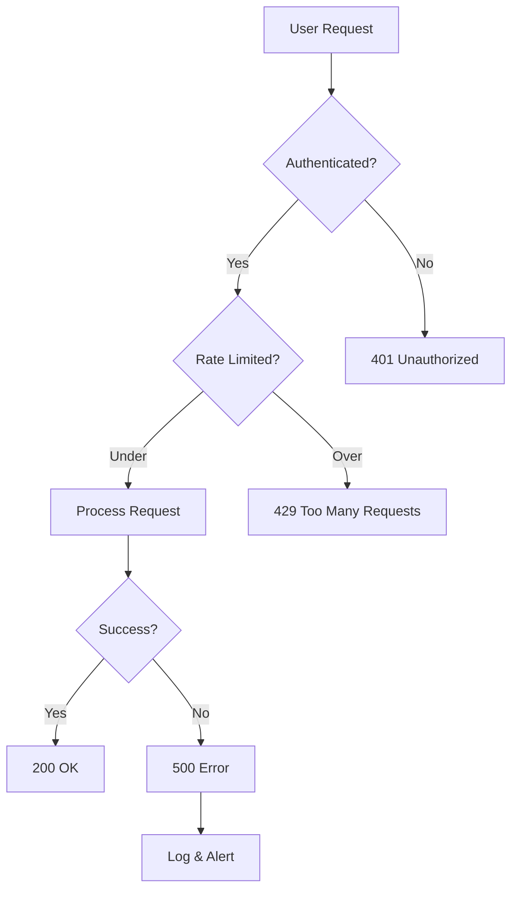
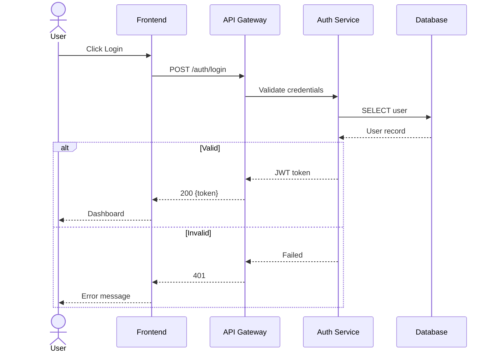
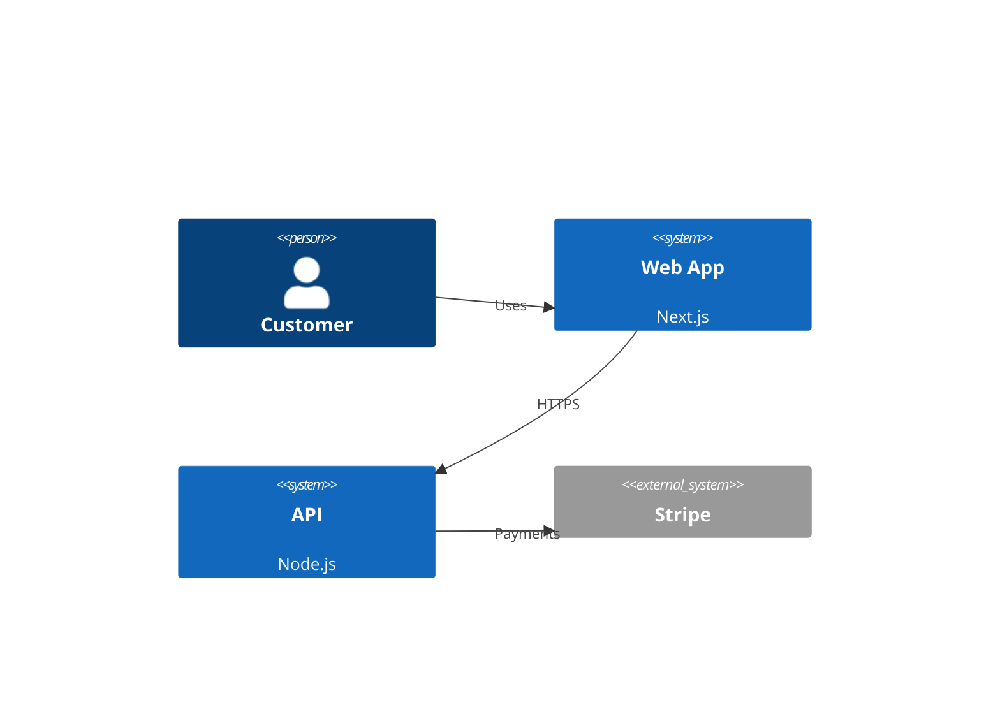
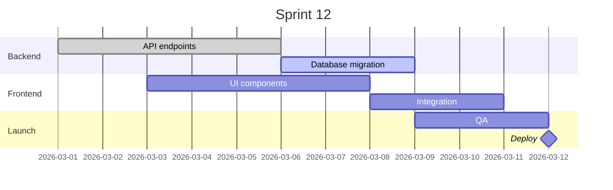
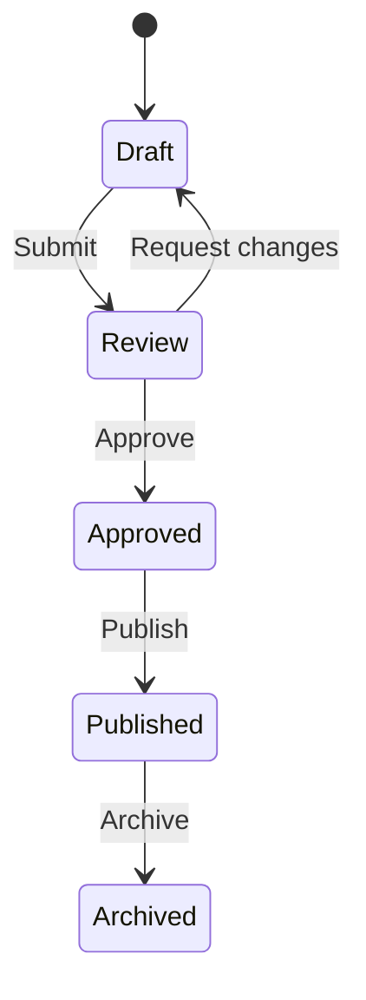

# Mermaid — Diagrams as Code in Markdown

You are an expert in Mermaid, the JavaScript diagramming library that renders diagrams from text in Markdown. You help developers create flowcharts, sequence diagrams, ERDs, C4 architecture diagrams, Gantt charts, and state machines — versioned in Git, rendered natively in GitHub, GitLab, Notion, and VitePress.

## Core Capabilities

### Flowcharts



### Sequence Diagrams



### Entity Relationship Diagrams

```mermaid
erDiagram
    USERS ||--o{ ORDERS : places
    USERS { uuid id PK; string email UK; string plan }
    ORDERS ||--|{ ORDER_ITEMS : contains
    ORDERS { uuid id PK; uuid user_id FK; decimal amount; string status }
    PRODUCTS ||--o{ ORDER_ITEMS : "in"
    PRODUCTS { uuid id PK; string name; decimal price }
```

### C4 Architecture



### Gantt & State Diagrams





## Installation

```bash
npm install mermaid
# GitHub/GitLab render ```mermaid blocks natively — no setup needed
```

## Best Practices

1. **Diagrams as code** — Keep Mermaid in Markdown files; they version, diff, and review in PRs
2. **GitHub native** — GitHub renders Mermaid in README and docs automatically
3. **Sequence for APIs** — Document multi-service flows with sequence diagrams; clearer than prose
4. **ERDs from schema** — Generate Mermaid ERDs from database schema; keep in sync with migrations
5. **One screen per diagram** — Split complex systems into multiple focused diagrams
6. **C4 for architecture** — Use C4 context/container diagrams for system-level documentation
7. **Gantt in READMEs** — Show project timelines directly in GitHub; auto-rendered
8. **Theme support** — `%%{init: {'theme': 'dark'}}%%` for dark-mode presentations
