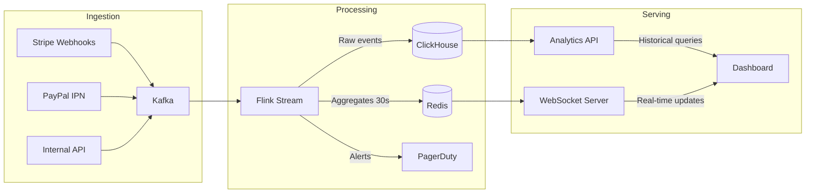

# Build an Interactive Analytics Dashboard from Scratch

Priya is an engineering lead at a 50-person fintech startup processing 2 million transactions per day. The operations team uses a Google Sheets dashboard that someone updates manually every morning. By the time leadership sees the numbers, they're 12 hours stale. When a payment processor goes down, nobody knows until customers complain. The CEO asks, "Why can't I see what's happening right now?"

Priya's team builds a real-time analytics dashboard using Recharts for interactive visualizations, with architecture documented in Mermaid diagrams and published via MkDocs Material.

## Step 1: Dashboard Layout with Recharts

The dashboard has three sections: KPI cards at the top, time-series charts in the middle, and breakdown tables at the bottom. Everything updates every 30 seconds via WebSocket.

```tsx
// src/components/dashboard/revenue-chart.tsx — Main revenue visualization
"use client";

import {
  AreaChart, Area, XAxis, YAxis, CartesianGrid, Tooltip,
  ResponsiveContainer, ReferenceLine, Brush,
} from "recharts";
import { useRealtimeMetrics } from "@/hooks/use-realtime-metrics";

interface RevenueDataPoint {
  timestamp: string;          // ISO timestamp
  revenue: number;            // Cents processed
  transactions: number;       // Transaction count
  errorRate: number;          // Percentage (0-100)
  p99Latency: number;        // Milliseconds
}

export function RevenueChart() {
  // Custom hook: connects to WebSocket, buffers last 24h of data
  const { data, isLive } = useRealtimeMetrics<RevenueDataPoint>("revenue", {
    windowHours: 24,
    intervalSeconds: 30,
  });

  // Dynamic threshold line — average of last 7 days at this time
  const dailyAverage = useDailyAverage(data);

  return (
    <div className="rounded-lg border bg-card p-6">
      <div className="mb-4 flex items-center justify-between">
        <h3 className="text-lg font-semibold">Transaction Volume</h3>
        <div className="flex items-center gap-2">
          <span className={`h-2 w-2 rounded-full ${isLive ? "bg-green-500 animate-pulse" : "bg-red-500"}`} />
          <span className="text-sm text-muted-foreground">
            {isLive ? "Live" : "Reconnecting..."}
          </span>
        </div>
      </div>

      <ResponsiveContainer width="100%" height={400}>
        <AreaChart data={data} margin={{ top: 10, right: 30, left: 20, bottom: 0 }}>
          <defs>
            {/* Gradient fill that transitions from blue to transparent */}
            <linearGradient id="revenueGradient" x1="0" y1="0" x2="0" y2="1">
              <stop offset="5%" stopColor="#4f46e5" stopOpacity={0.3} />
              <stop offset="95%" stopColor="#4f46e5" stopOpacity={0} />
            </linearGradient>
          </defs>

          <CartesianGrid strokeDasharray="3 3" stroke="#e5e7eb" />

          <XAxis
            dataKey="timestamp"
            tickFormatter={(ts) => new Date(ts).toLocaleTimeString([], {
              hour: "2-digit",
              minute: "2-digit",
            })}
            interval="preserveStartEnd"
          />

          <YAxis
            tickFormatter={(v) => `${(v / 100).toLocaleString("en-US", {
              style: "currency",
              currency: "USD",
              notation: "compact",
            })}`}
          />

          <Tooltip content={<RevenueTooltip />} />

          {/* Average line — makes anomalies instantly visible */}
          <ReferenceLine
            y={dailyAverage}
            stroke="#f59e0b"
            strokeDasharray="5 5"
            label={{ value: "7-day avg", fill: "#f59e0b", fontSize: 12 }}
          />

          <Area
            type="monotone"
            dataKey="revenue"
            stroke="#4f46e5"
            fill="url(#revenueGradient)"
            strokeWidth={2}
            dot={false}
            animationDuration={300}        // Fast animation for real-time feel
          />

          {/* Brush for zooming into specific time ranges */}
          <Brush dataKey="timestamp" height={30} stroke="#4f46e5" />
        </AreaChart>
      </ResponsiveContainer>
    </div>
  );
}

// Custom tooltip showing full details on hover
function RevenueTooltip({ active, payload, label }: any) {
  if (!active || !payload?.length) return null;

  const data = payload[0].payload as RevenueDataPoint;
  return (
    <div className="rounded-lg border bg-white p-3 shadow-lg dark:bg-gray-900">
      <p className="text-sm font-medium">
        {new Date(label).toLocaleString()}
      </p>
      <div className="mt-1 space-y-1 text-sm">
        <p>Revenue: <span className="font-mono font-semibold">
          ${(data.revenue / 100).toLocaleString()}
        </span></p>
        <p>Transactions: <span className="font-mono">{data.transactions.toLocaleString()}</span></p>
        <p>Error rate: <span className={`font-mono ${data.errorRate > 1 ? "text-red-500 font-bold" : ""}`}>
          {data.errorRate.toFixed(2)}%
        </span></p>
        <p>P99 latency: <span className="font-mono">{data.p99Latency}ms</span></p>
      </div>
    </div>
  );
}
```

## Step 2: Error Rate Heatmap with Plotly

For deeper analysis, Priya adds a Plotly heatmap showing error rates by hour and day of week. This reveals patterns: errors spike every Tuesday at 2 AM during the batch reconciliation job.

```python
# analytics-api/heatmap.py — Generate error rate heatmap data
# Served at /api/analytics/error-heatmap

import plotly.graph_objects as go
import pandas as pd
from datetime import datetime, timedelta

def generate_error_heatmap(transactions_df: pd.DataFrame) -> dict:
    """Generate hour-of-day × day-of-week error rate heatmap.

    Args:
        transactions_df: DataFrame with columns [timestamp, status]
                         status is 'success' or 'failed'

    Returns:
        Plotly figure JSON for frontend rendering
    """
    df = transactions_df.copy()
    df["hour"] = df["timestamp"].dt.hour
    df["day"] = df["timestamp"].dt.day_name()

    # Calculate error rate per hour×day bucket
    pivot = df.pivot_table(
        values="status",
        index="hour",
        columns="day",
        aggfunc=lambda x: (x == "failed").sum() / len(x) * 100,
    )

    # Reorder days Monday→Sunday
    day_order = ["Monday", "Tuesday", "Wednesday", "Thursday", "Friday", "Saturday", "Sunday"]
    pivot = pivot.reindex(columns=day_order)

    fig = go.Figure(data=go.Heatmap(
        z=pivot.values,
        x=pivot.columns,
        y=[f"{h:02d}:00" for h in pivot.index],
        colorscale="RdYlGn_r",            # Red = high error rate, green = low
        text=pivot.values.round(2),
        texttemplate="%{text:.1f}%",
        hovertemplate="Day: %{x}<br>Hour: %{y}<br>Error rate: %{z:.2f}%<extra></extra>",
        colorbar={"title": "Error Rate (%)"},
    ))

    fig.update_layout(
        title="Error Rate by Hour and Day of Week (Last 30 Days)",
        xaxis_title="Day",
        yaxis_title="Hour (UTC)",
        height=500,
    )

    return fig.to_json()
```

## Step 3: Architecture Documentation with Mermaid

The dashboard's data pipeline is complex — data flows from payment processors through Kafka, gets aggregated in ClickHouse, and served via a WebSocket API. Priya documents the architecture with Mermaid diagrams that live in the repo and render automatically in MkDocs.

````markdown
<!-- docs/architecture/data-pipeline.md -->
# Data Pipeline Architecture



The pipeline processes ~23K events per second during peak hours. 
Kafka provides a 72-hour retention buffer, so if ClickHouse goes 
down, no data is lost — events replay automatically on recovery.
````

## Step 4: Documentation Site with MkDocs Material

The dashboard documentation covers setup, architecture, runbooks, and API reference. MkDocs Material gives the team a polished docs site with search, dark mode, and code annotations.

```yaml
# mkdocs.yml
site_name: Analytics Dashboard
site_url: https://docs.internal.company.com/analytics
theme:
  name: material
  features:
    - navigation.instant
    - navigation.tabs
    - content.code.copy
    - content.code.annotate
    - search.suggest

plugins:
  - search
  - mermaid2                            # Render Mermaid diagrams

nav:
  - Home: index.md
  - Architecture:
    - Overview: architecture/overview.md
    - Data Pipeline: architecture/data-pipeline.md
    - WebSocket Protocol: architecture/websocket.md
  - Runbooks:
    - Dashboard Down: runbooks/dashboard-down.md
    - High Error Rate: runbooks/high-error-rate.md
    - Data Delay: runbooks/data-delay.md
  - API Reference:
    - Metrics API: api/metrics.md
    - WebSocket Events: api/websocket-events.md
```

## Results

The dashboard goes live after a 3-week sprint. The operations team detects a payment processor outage within 30 seconds instead of 2 hours. The CEO opens the dashboard on his phone during board meetings. The engineering team uses the error heatmap to identify that the Tuesday 2 AM spike is caused by a batch job that locks the payments table — they fix it and error rates drop from 0.8% to 0.1%.
